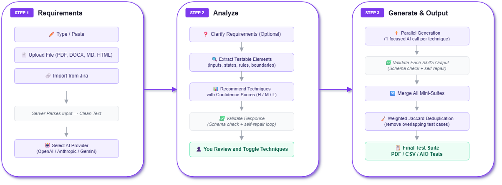
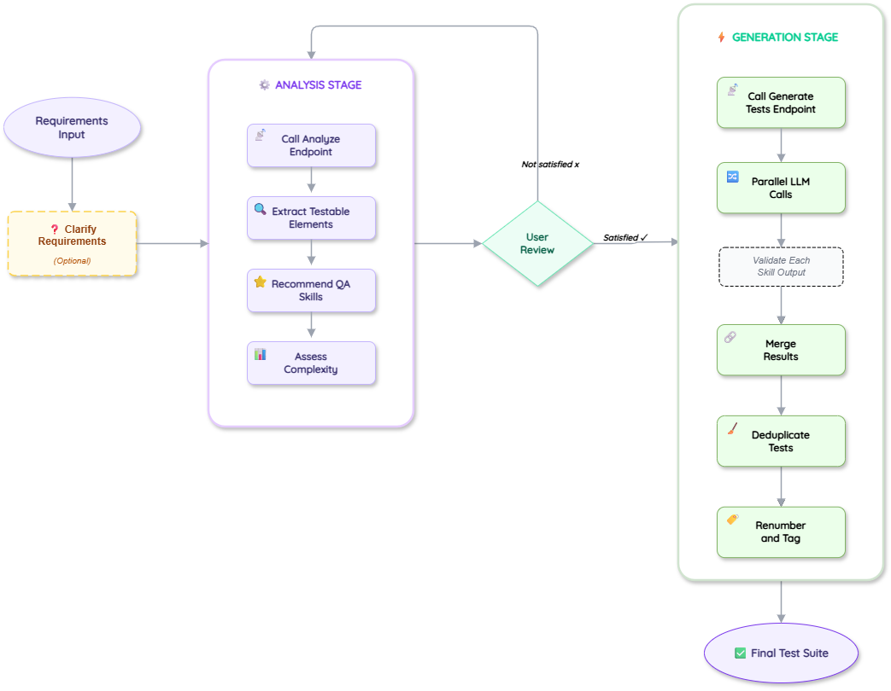
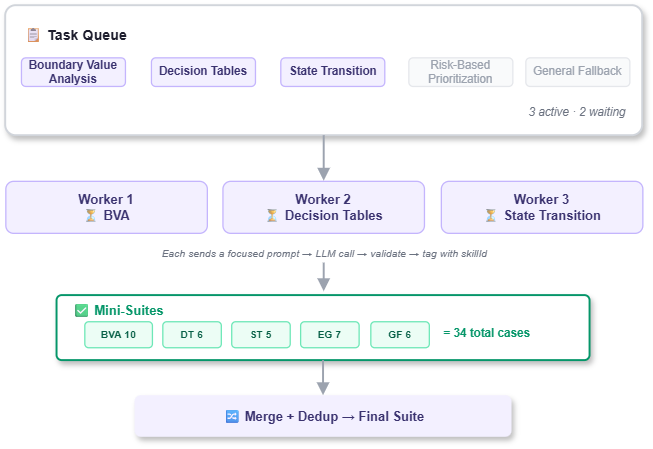

<div align="center">

<br/>


<br/>

# TestPilot AI

### Intelligent test design — from requirements to production-ready test cases in seconds.

<br/>

[](https://nodejs.org)
[](https://react.dev)
[](https://expressjs.com)
[](https://mui.com)
[](LICENSE)

<br/>

**OpenAI** &nbsp;&middot;&nbsp; **Anthropic Claude** &nbsp;&middot;&nbsp; **Google Gemini** &nbsp;&middot;&nbsp; **Jira Import** &nbsp;&middot;&nbsp; **AIO Tests Export**

---

**12 QA techniques** &nbsp;&nbsp;|&nbsp;&nbsp; **Parallel AI generation** &nbsp;&nbsp;|&nbsp;&nbsp; **Smart deduplication** &nbsp;&nbsp;|&nbsp;&nbsp; **Visual technique diagrams**

<br/>

</div>

## Overview

TestPilot AI takes software requirements as input and produces structured, prioritized test cases as output. It works the way a senior QA engineer thinks: first understand what needs testing, then pick the right techniques, then generate the scenarios.

You provide requirements by typing, uploading a file (PDF, DOCX, Markdown, HTML, plain text), or importing user stories directly from Jira. The system sends these to an AI provider of your choice (OpenAI, Anthropic, or Google Gemini) which analyzes the requirement and extracts testable elements — inputs, business rules, state transitions, boundary conditions, constraints, and integration points.

Based on what it finds, the AI recommends which of the 12 built-in QA techniques to apply, each with a confidence score. You review and adjust the selection, then the system generates test cases in parallel — one focused LLM call per technique, up to 3 running concurrently. The results are merged into a single suite, deduplicated using weighted similarity matching, and presented as a searchable, filterable table with priority and type breakdowns.

From there you can export the suite as PDF or CSV, or push it directly to AIO Tests in Jira with auto-created folder hierarchies, priority mapping, and coverage tags.

---

## 3-Step Wizard Flow

<p align="center"></p>

The user moves through three stages: provide requirements and configure the AI provider, let the AI analyze and recommend testing techniques, then review the generated test cases and export them.

---

## How It Works — The AI Pipeline

<p align="center"></p>

**Stage 1 — Analyze** (`POST /api/analyze`)

1. Extract testable elements (inputs, states, rules, boundaries, constraints, integrations)
2. Recommend QA skills with confidence scores (high / medium / low)
3. Assess complexity (simple / moderate / complex)

**User reviews & confirms** — toggle techniques on/off, select optional diagrams

**Stage 2 — Generate** (`POST /api/generate-tests`)

1. Run parallel LLM calls (max 3 concurrent), one per selected skill
2. Each skill gets its own focused prompt with the full requirement context
3. Merge all results into a single suite
4. Deduplicate using weighted Jaccard similarity (title 40% &middot; steps 40% &middot; expected 20%, threshold 60%)
5. Renumber and tag final test cases

---

## Parallel Execution

<p align="center"></p>

## Architecture

| Layer | Components |
|-------|-----------|
| **Client** | React 19 + MUI 6 + Vite &mdash; 3-step wizard, Mermaid.js diagram viewer |
| **Server** | Express 5 + Node.js &mdash; Prompt Engine, Skill Loader (12 .md playbooks), Schema Validator (Ajv), Merge + Dedup |
| **AI Providers** | OpenAI, Anthropic Claude, Google Gemini &mdash; switchable per request |
| **Integrations** | Jira Cloud (import stories), AIO Tests (export cases) &mdash; server-configured or user-provided credentials |

---

## QA Skills Library

12 expert playbooks in `skills/` that guide the AI like a test design handbook:

| # | Skill | What It Targets |
|---|-------|----------------|
| 1 | **Equivalence Partitioning** | Input domain classes — valid & invalid partitions |
| 2 | **Boundary Value Analysis** | Off-by-one, limits, edges of input ranges |
| 3 | **Decision Tables** | Complex business rules with multiple conditions |
| 4 | **State Transition** | Stateful workflows, lifecycle transitions |
| 5 | **Pairwise / Combinatorial** | Multi-parameter interactions, config combinations |
| 6 | **Error Guessing & Heuristics** | Common failure modes, past-bug patterns |
| 7 | **Risk-Based Prioritization** | High-impact, high-likelihood scenarios first |
| 8 | **Requirements Traceability** | Full requirement-to-test coverage mapping |
| 9 | **Feature Decomposition** | Breaking features into atomic testable units |
| 10 | **Functional Core** | Core happy-path and business logic validation |
| 11 | **Non-Functional Baseline** | Performance, security, usability baselines |
| 12 | **General Fallback** | Catch-all baseline — always included |

---

## Test Case Output

Each generated test case is structured and atomic:

```json
{
  "id": "TC-001",
  "title": "Verify that checkout fails when cart is empty",
  "type": "negative",
  "priority": "P0",
  "preconditions": ["User is logged in", "Cart is empty"],
  "steps": [
    "Navigate to checkout page",
    "Click Place Order"
  ],
  "expected": [
    "Error message: 'Your cart is empty'",
    "User remains on checkout page"
  ],
  "coverageTags": ["checkout", "boundary-value-analysis"],
  "requirementRefs": ["REQ-001"]
}
```

**Types:** `functional` &middot; `negative` &middot; `boundary` &middot; `security` &middot; `accessibility` &middot; `performance` &middot; `usability` &middot; `compatibility` &middot; `resilience`

**Priorities:** `P0` Critical &middot; `P1` High &middot; `P2` Medium &middot; `P3` Low

---

## Quick Start

### Prerequisites

- **Node.js 18+** (20+ recommended)
- An API key for at least one provider:
  [OpenAI](https://platform.openai.com/api-keys) &middot; [Anthropic](https://console.anthropic.com/settings/keys) &middot; [Google AI Studio](https://aistudio.google.com/apikey)

### Install & Run

```bash
# Clone
git clone https://github.com/rameshlakmal/Test-Scenario-Generator.git
cd Test-Scenario-Generator

# Install dependencies
npm install && cd client && npm install && cd ..

# Configure
cp .env.example .env
# Edit .env — add at least one API key

# Start (server + client with hot reload)
npm run dev
```

Open **http://localhost:5173** and start generating.

---

## Configuration

All settings live in `.env`:

| Variable | Default | Description |
|----------|---------|-------------|
| `LLM_PROVIDER` | `openai` | Active provider: `openai`, `anthropic`, or `gemini` |
| `OPENAI_API_KEY` | — | OpenAI API key |
| `ANTHROPIC_API_KEY` | — | Anthropic API key |
| `GEMINI_API_KEY` | — | Google Gemini API key |
| `PORT` | `3001` | Server port |
| `MAX_UPLOAD_MB` | `2` | Max file upload size (MB) |
| `MAX_TEST_CASES` | `160` | Hard cap on generated test cases |
| `LLM_TIMEOUT_MS` | `45000` | LLM request timeout (ms) |
| `RATE_LIMIT_PER_MINUTE` | `90` | API rate limit per minute |
| `CORS_ORIGINS` | `localhost:5173` | Allowed origins (comma-separated or `*`) |

<details>
<summary><strong>Jira Integration (Optional)</strong></summary>

```env
JIRA_BASE_URL=https://your-domain.atlassian.net
JIRA_EMAIL=you@company.com
JIRA_API_TOKEN=your-token
```

Enables the **Import from Jira** tab — browse projects, epics, sprints, and pull user stories directly. When not server-configured, users can enter credentials in the UI.

</details>

<details>
<summary><strong>AIO Tests Export (Optional)</strong></summary>

```env
AIO_BASE_URL=https://tcms.aiojiraapps.com/aio-tcms
AIO_TOKEN=your-token
```

Push generated test cases to [AIO Tests](https://marketplace.atlassian.com/apps/1222843) with auto-created folder hierarchies, priority mapping, and coverage tags. When not server-configured, users can enter credentials in the Results stage.

</details>

---

## API Reference

| Method | Endpoint | Description |
|--------|----------|-------------|
| `GET` | `/api/health` | Health check |
| `GET` | `/api/providers` | List server-configured providers (LLM, Jira, AIO) |
| `GET` | `/api/skills` | List loaded QA skills |
| `POST` | `/api/validate-key` | Validate a user-provided API key |
| `POST` | `/api/models` | List available models for a provider |
| `POST` | `/api/preflight` | Identify ambiguities before generation |
| `POST` | `/api/analyze` | Analyze requirement, recommend techniques |
| `POST` | `/api/generate-tests` | Generate test suite (per-skill parallel) |
| `GET` | `/api/jira/status` | Check Jira connection status |
| `GET` | `/api/jira/projects` | List Jira projects |
| `GET` | `/api/jira/epics` | List epics for a project |
| `GET` | `/api/jira/sprints` | List sprints for a project |
| `GET` | `/api/jira/stories` | Search stories with filters |
| `POST` | `/api/jira/story-details` | Fetch full story details |
| `POST` | `/api/aio/push` | Export test cases to AIO Tests |

---

## Project Structure

```
testpilot-ai/
|
+-- server/                         <- Express.js backend (CommonJS)
|   +-- index.js                    # Routes, orchestration, main entry
|   +-- prompt.js                   # Prompt builders (analysis, per-skill, preflight)
|   +-- schema.js                   # JSON schemas for validation (Ajv)
|   +-- util.js                     # JSON parsing, dedup, suite merging
|   +-- selectSkills.js             # Keyword-based skill selection (fallback)
|   +-- skills.js                   # Skill loader (parses markdown playbooks)
|   +-- jira.js                     # Jira Cloud API integration
|   +-- aio.js                      # AIO Tests export
|   +-- llm/
|       +-- index.js                # Provider router
|       +-- openai.js               # OpenAI adapter
|       +-- anthropic.js            # Anthropic Claude adapter
|       +-- gemini.js               # Google Gemini adapter
|
+-- client/                         <- React + Vite SPA (ESM)
|   +-- public/
|   |   +-- test-cases.png          # App logo
|   +-- src/
|       +-- App.jsx                 # Main shell, state, stepper orchestration
|       +-- StepRequirements.jsx    # Step 1: input, provider config, Jira import
|       +-- StepAnalyze.jsx         # Step 2: analysis, technique selection, diagrams
|       +-- StepResults.jsx         # Step 3: results, filters, export, AIO push
|       +-- DiagramDialog.jsx       # Fullscreen Mermaid diagram viewer
|       +-- MermaidDiagram.jsx      # Mermaid.js renderer
|       +-- helpers.jsx             # Shared utility components (PDF, CSV, lists)
|       +-- theme.js                # Theme constants, model options
|
+-- skills/                         <- 12 QA technique playbooks (.md)
+-- docs/                           <- Architecture and flow diagrams
+-- .env.example                    # Environment variable template
+-- package.json
```

---

## Tech Stack

| Layer | Technology |
|-------|-----------|
| **Backend** | Express.js 5, Node.js 18+, Ajv, Helmet |
| **Frontend** | React 19, Material UI 6, Vite 7, Mermaid.js 11 |
| **AI Providers** | OpenAI, Anthropic Claude, Google Gemini |
| **Integrations** | Jira Cloud REST API, AIO Tests TCMS |
| **File Parsing** | pdf-parse, mammoth (DOCX), cheerio (HTML) |

---

<div align="center">

<br/>

**Built so QA engineers can focus on thinking, not typing.**

<br/>

*Star the repo if this saves you time.*

</div>
